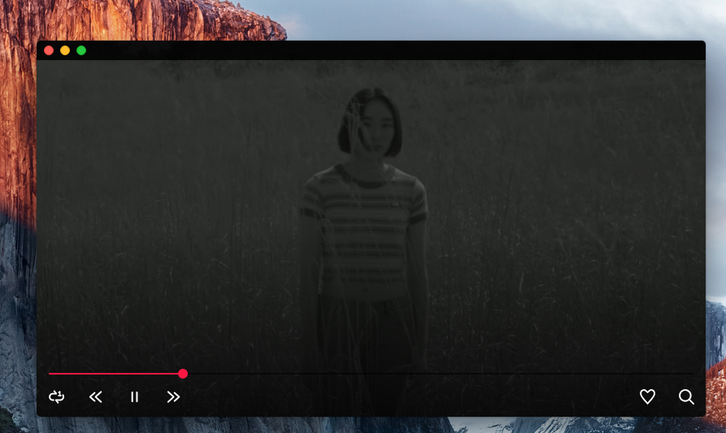
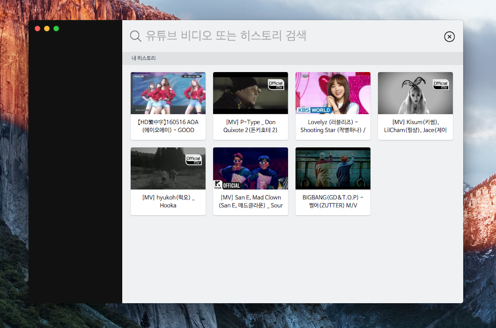

# electron-mini-youtube-player

This is a youtube player for Electron application.
**tested on only mac os**


**Mac OS**






Download Mini
--------
1. [Download](https://www.dropbox.com/s/ld93yl43ie49ipt/Mini-darwin-x64.zip?dl=0) - Mac Os
2. Drag Mini from your Downloads folder to the Applications folder.
3. Right click on Mini.
4. Choose "Open".
5. If a warning dialog is shown, choose "Open".


Features
--------
- (Youtube)Search Video
- Search History
- Play List
- Play Loop
- Resize Screen
- Full Screen
- Always On Top


Getting Started
---------------
```bash
# Clone this repository
$ git clone https://github.com/gilhyun/electron-mini-youtube-player
# Go into the repository
$ cd electron-mini-youtube-player
# Install dependencies and run the app
$ npm install
$ node server.js
$ HOT=1 NODE_ENV=development ./node_modules/.bin/electron .
```

Edit api key /app/api/youtubeData.js
---------------
```bash
const youtubeKeys = [
  'YOUR_YOUTUBE_API_KEY'
]
```


Package app
---------------
```bash
$ (sudo) npm install -g webpack
$ NODE_ENV=production node package.js
---
## look ./release/darwin-x64/Mini-darwin-x64
```
